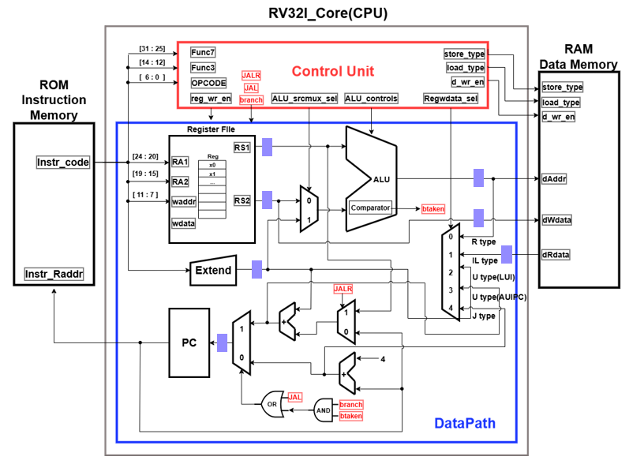
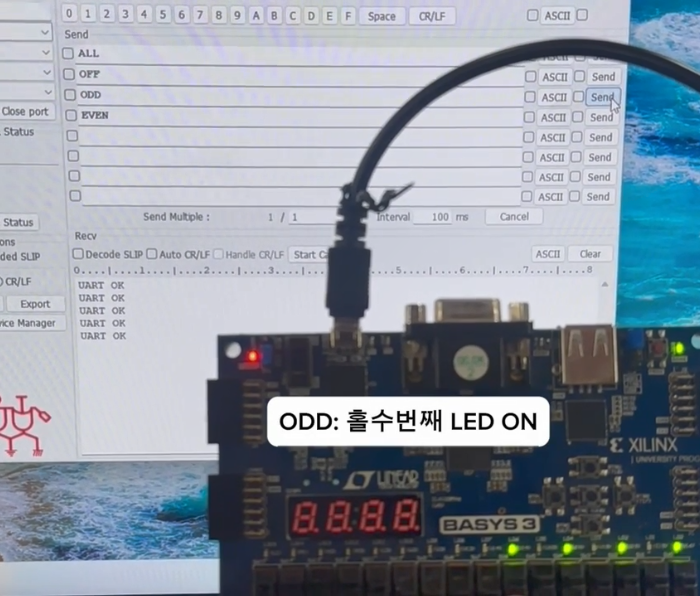

# 🖥️ RISC-V(RV32I) Multi-Cycle CPU & APB BUS & UART 설계

> RISC-V 기반 Multi-Cycle CPU를 설계하고, APB 버스를 통해 UART Peripheral을 제어하는 SoC 구조를 구현한 프로젝트


---

## 📋 프로젝트 개요

RISC-V 기반 Multi-Cycle CPU를 설계하고, APB 버스를 통해 UART Peripheral을 제어하는 SoC 구조를 구현한 프로젝트입니다.

### 🎯 주요 목표
- FSM 기반 Multi-Cycle RISC-V CPU 설계 (Fetch-Decode-Execute)
- APB Master 식점 설계 및 CPU-UART SoC 구조 구현
- RV32I 37개 명령어 및 UART 기능 동합 검증

---

## ✨ 주요 기능

### 1. RISC-V CPU 설계
- **FSM 기반 Multi-Cycle** RISC-V CPU 설계 (Fetch-Decode-Execute)
- **APB Master** 식점 설계 및 **CPU-UART SoC** 구조 구현
- **RV32I 37개** 명령어 및 **UART 기능** 동합 검증

### 2. Multi-Cycle 구조
- **RISC-V 37개 모든 명령어가 Multi-Cycle 구조에서 정상 실행** 확인
  - R-Type, I-Type, S-Type, L-Type, B-Type (각각 3~5 cycle로 동작)
- **UART 명령(ODD/ALL/OFF 등)**에 따라 **FPGA LED를 제어**하며
  - CPU → APB → UART → Peripheral 제어 흐름을 실시간으로 검증

### 3. FPGA 실제 동작
- **CPU → APB → UART → Peripheral** 제어 흐름을 실시간으로 검증

---

## 🏗️ 시스템 아키텍처

### 📊 RISC-V Multi-Cycle FSM
```
        ┌──────────┐
        │  Fetch   │
        └────┬─────┘
             ▼
        ┌──────────┐
        │  Decode  │
        └────┬─────┘
             ▼
   ┌─────────┴─────────┐
   ▼                   ▼
┌────────┐        ┌────────┐
│ R-Type │   ...  │ L-Type │
│  EXE   │        │  EXE   │
└───┬────┘        └────┬───┘
    │                  │
    └─────────┬────────┘
              ▼
        ┌──────────┐
        │ L-type   │
        │   MEM    │
        └────┬─────┘
             ▼
        ┌──────────┐
        │ L-type   │
        │  Write   │
        │   back   │
        └──────────┘

       5 Clock Cycle
```
### 📊 RISC-C Top Block Diagram


### 📊 PC & FPGA 동작 화면


**ODD: 홀수번째 LED ON**

---

## 🔧 개발 환경

|       항목       | 사양 |
|------------------|------|
|   **Language**   | SystemVerilog, Verilog |
|     **Tool**     | Vivado |
|     **FPGA**     | Basys3 (Xilinx) |
|      **ISA**     | RISC-V RV32I (37 instructions) |
| **Bus Protocol** | APB (Advanced Peripheral Bus) |

---

## 📈 성능 지표

### ✅ 검증 결과
- **RISC-V 37개 모든 명령어가 Multi-Cycle 구조에서 정상 실행** 확인
  - R-Type, I-Type, S-Type, L-Type, B-Type (각각 3~5 cycle로 동작)
- **UART 명령(ODD/ALL/OFF 등)**에 따라 **FPGA LED를 제어**하며
  - CPU → APB → UART → Peripheral 제어 흐름을 실시간으로 검증

### 🐛 Trouble Shooting

#### 1. 문제: UART로 ODD 명령을 연속 입력 시, 문자열을 한 번에 인식하지 못해
- **원인**: LED 제어가 정상 동작하지 않음
- **해결**: 문자 스트림 특성을 고려해 O → O·D → D를 **순차 인식하는 상태 기반 파싱 로직**을 적용하여 명령 인식 안정화

#### 2. 문제: UART로 ODD 명령을 연속 입력 시, 문자열을 한 번에 인식하지 못해
- **원인**: LED 제어가 정상 동작하지 않음
- **해결**: 문자 스트림 특성을 고려해 O → O·D → D를 **순차 인식하는 상태 기반 파싱 로직**을 적용하여 명령 인식 안정화

---

## 📁 프로젝트 구조

```
RISC-V-CPU/
├── rtl/                    # RTL 소스 코드
│   ├── cpu_core/
│   │   ├── fetch.v
│   │   ├── decode.v
│   │   ├── execute.v
│   │   ├── memory.v
│   │   └── writeback.v
│   ├── apb_master.v
│   ├── uart_peripheral.v
│   └── soc_top.v
├── tb/                     # Testbench 파일
│   └── tb_soc.v
├── asm/                    # Assembly 테스트 코드
│   ├── test_rtype.s
│   ├── test_branch.s
│   └── test_uart.s
├── images/                 # 문서용 이미지
└── README.md
```

---

## 🚀 사용 방법

### 1. Assembly 코드 작성
```assembly
# test.s
addi x1, x0, 10      # x1 = 10
addi x2, x0, 20      # x2 = 20
add  x3, x1, x2      # x3 = x1 + x2
sw   x3, 0(x0)       # Store to memory
```

### 2. 시뮬레이션 실행
```bash
# Vivado Simulation
vivado -mode batch -source run_sim.tcl
```

### 3. FPGA 합성 및 다운로드
```tcl
# Vivado에서
source build.tcl
program_hw_devices
```

### 4. UART 명령 테스트
```
# Serial Terminal (9600 baud)
ODD   → 홀수번 LED ON
ALL   → 모든 LED ON
OFF   → 모든 LED OFF
```

---

## 📚 RISC-V RV32I 명령어

| Type | 명령어 수 | 예시 |
|------|----------|------|
| **R-Type** | 10 | ADD, SUB, AND, OR, XOR, SLL, SRL, SRA, SLT, SLTU |
| **I-Type** | 13 | ADDI, ANDI, ORI, XORI, SLTI, SLTIU, SLLI, SRLI, SRAI, LB, LH, LW, LBU, LHU |
| **S-Type** | 3 | SB, SH, SW |
| **B-Type** | 6 | BEQ, BNE, BLT, BGE, BLTU, BGEU |
| **U-Type** | 2 | LUI, AUIPC |
| **J-Type** | 1 | JAL |
| **I-Type (Jump)** | 1 | JALR |
| **I-Type (System)** | 1 | ECALL |

**Total: 37개 명령어**

---

## 📚 참고 자료

- [RISC-V ISA Specification](https://riscv.org/technical/specifications/)
- [APB Protocol Specification](https://developer.arm.com/documentation/ihi0024/latest/)
- [Basys3 Reference Manual](https://digilent.com/reference/programmable-logic/basys-3/reference-manual)

---

## 👤 Author

**이서영 (Lee Seoyoung)**
- 📧 Email: lsy1922@naver.com
- 🔗 GitHub: [@seoY0206](https://github.com/seoY0206)

---

## 📝 License

This project is for educational purposes.

---

<div align="center">

**⭐ 도움이 되었다면 Star를 눌러주세요! ⭐**

</div>
